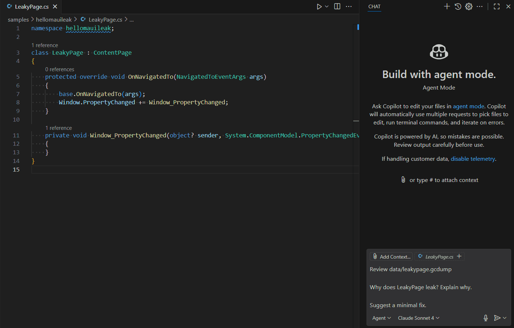

# gcdump-analyze

Command-line tools for analyzing .gcdump files produced by `dotnet gcdump`.

This repository contains a core analysis library plus two clients:

- `gcdump-analyze` — a .NET global tool/CLI that prints Markdown reports and tree views.
- `gcdump-analyze-mcp` — an MCP (Model Context Protocol) server exposing the same functionality over stdio.

This README explains how to install and use the `gcdump-analyze` .NET global tool from NuGet.org and provides example invocations.

An example of the tool in action, resolving a memory leak in `LeakyPage.cs`:



## Install (from NuGet)

The `gcdump-analyze` CLI is published as a .NET global tool package on NuGet.org. To install it globally for your user account:

```pwsh
dotnet tool install --global gcdump-analyze
```

To run the tool without installing globally (one-off):

```pwsh
dotnet tool run gcdump-analyze -- [command] [options]
```

## Usage

Run `gcdump-analyze --help` to show top-level help. The tool exposes subcommands that map to the core library APIs.

Common commands:

- `top` — Show top types by Inclusive Size (retained).
- `top-size` — Show top types by shallow Size (Bytes).
- `top-count` — Show top types by object Count.
- `filter` — Show rows for types whose name contains a substring (case-insensitive).
- `roots` — Show hot path(s) to GC roots for matching types (tree view).

Basic examples:

Show the top 10 types by retained (inclusive) size:

```pwsh
gcdump-analyze top path\to\heap.gcdump
```

Example output (top by inclusive size):

Object Type                                                               | Count | Size (Bytes) | Inclusive Size (Bytes)
------------------------------------------------------------------------- | ----: | -----------: | ---------------------:
[static vars]                                                             |     1 |            0 |                927,560
Microsoft.Maui.Controls.ResourceDictionary                                |     4 |          320 |                227,888
Android.Runtime.XAPeerMembers                                             |   139 |       11,120 |                208,368
[other roots]                                                             |     1 |            0 |                205,216
hellomauileak.App                                                         |     1 |          512 |                202,728
[static var Microsoft.Maui.Controls.Application.<Current>k__BackingField] |     1 |            0 |                202,728
System.Collections.Generic.List<Microsoft.Maui.Controls.Element>          |    27 |          864 |                198,576
Microsoft.Maui.Controls.Element[]                                         |    17 |        1,024 |                197,776
[other Handles]                                                           |     1 |            0 |                195,864
System.String                                                             | 1,982 |      142,544 |                142,544

Show top 8 by inclusive size:

```pwsh
gcdump-analyze top -r 8 path\to\heap.gcdump
```

Show top by shallow size (default 10 rows):

```pwsh
gcdump-analyze top-size path\to\heap.gcdump
```

Example output (top by shallow size):

Object Type                                                                     | Count | Size (Bytes) | Inclusive Size (Bytes)
------------------------------------------------------------------------------- | ----: | -----------: | ---------------------:
System.String                                                                   | 1,982 |      142,544 |                142,544
System.RuntimeType                                                              | 2,740 |      109,600 |                140,912
Microsoft.Maui.Controls.BindableProperty                                        |   486 |       62,208 |                139,976
System.Action<Microsoft.Maui.IElementHandler,Microsoft.Maui.IElement>           |   309 |       39,552 |                109,648
System.Int32[]                                                                  |   507 |       38,104 |                 38,104
Microsoft.Maui.Controls.BindableProperty.BindingPropertyChangedDelegate         |   208 |       26,624 |                 26,624
System.Collections.Generic.Dictionary<System.String,Java.Interop.JniMethodInfo> |   311 |       24,880 |                102,704
System.RuntimeType.TypeCache                                                    |   358 |       22,912 |                 31,312
System.Collections.Generic.Dictionary<System.String,Java.Interop.JniFieldInfo>  |   280 |       22,400 |                 26,552
Java.Interop.JniMethodInfo                                                      |   374 |       17,952 |                 17,952

Show top by object count and write to a file:

```pwsh
gcdump-analyze top-count -r 20 path\to\heap.gcdump --output out.md
```

Filter types whose names contain "LeakyPage":

```pwsh
gcdump-analyze filter -n LeakyPage path\to\leakypage.gcdump
```

Example output (filter by name):

Object Type             | Count | Size (Bytes) | Inclusive Size (Bytes)
----------------------- | ----: | -----------: | ---------------------:
hellomauileak.LeakyPage |     3 |        2,520 |                 31,800

Show hot paths to GC roots for types containing "LeakyPage":

```pwsh
gcdump-analyze roots -n LeakyPage path\to\leakypage.gcdump
```

Example output (paths to root):

```text
├── hellomauileak.LeakyPage (Count: 3)
│   └── System.ComponentModel.PropertyChangedEventHandler (Count: 3)
│       └── System.Delegate[] (Count: 3)
│           └── System.ComponentModel.PropertyChangedEventHandler (Count: 3)
│               └── Microsoft.Maui.Controls.Window (Count: 3)
│                   └── Microsoft.Maui.Controls.Element[] (Count: 3)
│                       └── System.Collections.Generic.List<Microsoft.Maui.Controls.Element> (Count: 3)
│                           └── hellomauileak.App (Count: 3)
```

## Options

- `-r, --rows <n>`: Number of rows to display (default: 10) for `top`, `top-size`, and `top-count`.
- `-n, --name <substring>`: Required for `filter` and `roots` to select matching type names.
- `-o, --output <file>`: Write output to a file instead of stdout.

All commands expect a single `.gcdump` file path argument.

## Output

By default the CLI prints Markdown tables for `top`, `top-size`, `top-count`, and `filter` commands. The `roots` command prints a box-drawing tree of hot paths to GC roots.

Examples of output formats are in the repository tests and snapshots.

## MCP server

The `gcdump-analyze-mcp` tool runs an MCP server exposing the same tools (useful for editor integrations). See `src/gcdump-analyze-mcp` for details and [`.github/instructions/gcdump-analyze-mcp.md`](.github/instructions/gcdump-analyze-mcp.md) for VS Code configuration.

## Contributing

See the repository for unit tests (xUnit + Verify) and instructions for running them. Run tests with:

```pwsh
dotnet test src/gcdump-analyze-tests/gcdump-analyze-tests.csproj
```

## Notes

- Requires .NET 9 SDK for building and running.
- The core library provides programmatic APIs useful for embedding in other tools or servers.
